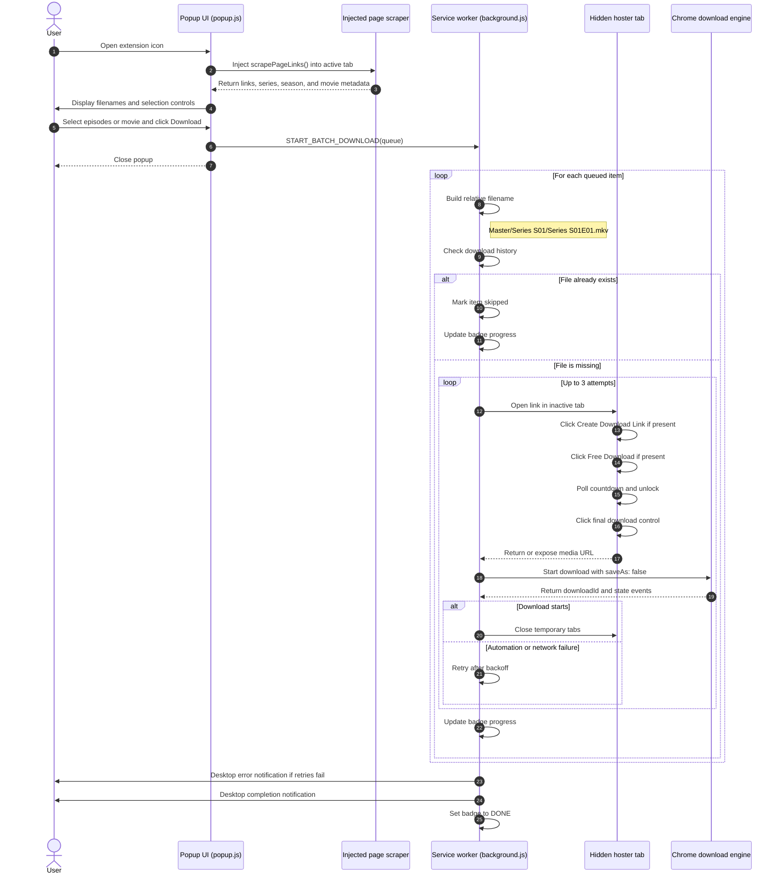

# Movie Batch Downloader

A two-engine downloader for movie and TV-series pages that expose downloadable links. The original Python Playwright CLI provides a terminal-first workflow with byte-level progress, while the companion Manifest V3 Chrome extension provides popup selection and background-tab automation.

Both engines discover links from a source page, automate the supported hoster, skip completed files, retry transient failures, and organize media for library scanners such as Plex or VLC.

## Choose an Engine

| Engine | Best for | Entry point |
| --- | --- | --- |
| Python Playwright CLI | Detailed terminal progress, explicit replacement prompts, and scripted runs | `main.py` |
| Manifest V3 Chrome extension | Selecting episodes from the current browser page and continuing downloads in the background | `chrome-extension/` |

The two engines share the same overall workflow but are separate implementations. The CLI streams the captured media URL itself; the extension hands the captured URL to Chrome's native download manager.

## Features

- Download one episode, selected episodes, or all discovered episodes.
- Process batch downloads sequentially, one file at a time.
- Retry a failed episode up to three times with a short backoff.
- Show a queue dashboard with statuses such as `QUEUED`, `TRY`, `DONE`, `SKIPPED`, `FAILED`, and `CANCELLED`.
- Display a byte-level progress bar while streaming the media file.
- Ask before replacing an existing completed file.
- Remove incomplete files after a failed or cancelled download.
- Organize series by show and season.
- Organize ordinary movies in their own show/movie folder.
- Cancel safely with `Ctrl+C`.

## Requirements

- Python 3.10 or newer
- A working internet connection
- Chromium for Playwright
- Permission to download the media you request

## Setup

From the project directory, create and activate a virtual environment:

```bash
python3 -m venv venv
source venv/bin/activate
```

Install the Python dependencies:

```bash
python -m pip install -r python-cli/requirements.txt
```

Install the Playwright Chromium browser:

```bash
python -m playwright install chromium
```

On Linux systems that are missing browser libraries, Playwright may also require:

```bash
python -m playwright install-deps chromium
```

## Running

Use the virtual-environment Python executable:

```bash
./venv/bin/python python-cli/main.py
```

Or activate the environment first and run:

```bash
source venv/bin/activate
python python-cli/main.py
```

The program asks for a movie or series page URL:

```text
Enter Series/Movie URL: https://thenkiri.com/lioness-s03-complete-tv-series/
```

After the links are found, select everything or enter comma-separated numbers:

```text
Select episodes to download ('all' or numbers e.g. 1,2,4): all
```

Examples:

```text
all
1
1,2,4
```

## Output Layout

TV series are stored using the detected show name and season number:

```text
downloads/
└── Lioness/
    └── Season 03/
        └── Lioness.S03E07.mkv
```

A normal movie is stored in its own folder:

```text
downloads/
└── Inception/
    └── Inception.mkv
```

The program prints the absolute download path when a file completes or when an existing file is found.

## Existing Files

If a completed file already exists, the program reports its location and asks whether it should be replaced:

```text
Already downloaded: /path/to/downloads/Lioness/Season 03/Lioness.S03E07.mkv
Replace this file? [y/N]:
```

- Enter `y` or `yes` to replace it.
- Press Enter or enter `n` to keep it and continue.
- Incomplete files are removed before a fresh attempt.

## Retry and Cancellation

Each episode is attempted up to three times. A failed episode is retried without stopping the rest of the batch. If all attempts fail, it is marked `FAILED` and the next selected item continues.

Press `Ctrl+C` to cancel the active download or the whole batch. The active partial file is removed, completed files are kept, and unfinished queue items are marked `CANCELLED`.

Downloads are sequential rather than concurrent. Selecting `all` does not open 10 or 20 simultaneous downloads; it completes one item before starting the next.

## Website Support

The current implementation is primarily designed for:

- Nkiri pages as the source page where movie or episode links are discovered.
- Downloadwella pages as the supported automated hoster.

The scraper recognizes some links containing `downloadwella`, `pixeldrain`, `mega.nz`, `.mkv`, or `.mp4`, but only Downloadwella has a dedicated browser-download flow. Other websites and hosters may use different page structures, APIs, authentication, timers, or anti-bot systems and may require additional handlers.

The downloader does not improve video quality. It saves the file provided by the source hoster.

## Chrome Extension

The extension is a Manifest V3 companion for browser-based selection:

1. Open a series or movie listing page and open the extension popup.
2. The popup scraper extracts supported host links and derives series, season, episode, or movie metadata.
3. Select all items, Season 1, or individual checkboxes and press **Download**.
4. The background service worker opens inactive tabs, clicks link-generator and hoster controls, waits through timers, and detects the media URL.
5. Chrome downloads each file with `saveAs: false`, routing it into a relative series/season path under the configured Downloads directory.

### Extension Architecture



Example extension layout:

```text
Downloads/
└── Reacher S04/
    └── Reacher S04E06.mkv
```

The extension supports retries, duplicate-file filtering, progress badges, desktop error/completion notifications, movie links without episode codes, and quick popup presets. Open the extension's options page to set an optional relative master directory such as `Media/TV Series`; leave it empty to use the normal Downloads folder.

### Extension Setup

#### Installing Unpacked Extension

1. Clone or download this repository to your computer:

    ```bash
    git clone https://github.com/HeisDonne/nkiri-batch-downloader.git
    cd nkiri-batch-downloader
    ```

    If you downloaded a ZIP archive, extract it and open the extracted project folder instead.

2. Open your browser's extension management page:

    - **Chrome:** `chrome://extensions/`
    - **Brave:** `brave://extensions/`
    - **Edge:** `edge://extensions/`

3. Enable **Developer mode** using the toggle switch, usually in the top-right corner.

4. Click **Load unpacked** and select the repository's `chrome-extension/` directory.

5. Open the extension options page if you want to configure a custom relative master directory. Leave it empty to save directly under the browser's normal `Downloads/` folder.

6. Reload the extension after changing its files.

Chrome must have **Ask where to save each file before downloading** disabled for fully automatic batch routing. The extension intentionally uses Chrome's native download manager, so transfers remain visible in `chrome://downloads`.

## Troubleshooting

### Playwright browser is missing

Run:

```bash
./venv/bin/python -m playwright install chromium
```

### A download fails repeatedly

The hoster may be unavailable, rate-limiting requests, or returning a changed page. Try the episode again later or select a smaller group of episodes.

### The progress bar is slow

The transfer speed is controlled by the source hoster and your connection. Downloads are intentionally sequential to reduce load and keep the queue predictable.

### The page has no downloadable links

The source page may have changed, require a login, or use a hoster that is not implemented yet.

## Project Files

```text
python-cli/              Python Playwright CLI engine
    main.py              Downloader application
    requirements.txt     Python dependencies
downloads/               CLI downloaded media and organized folders
chrome-extension/        Manifest V3 browser engine
    background.js          Queue, retries, hoster automation, native downloads
    popup.js               Source-page scraper and episode selection
    popup.html             Extension popup UI
    options.html/js        Synced master-directory settings
README.md                Project documentation
```
